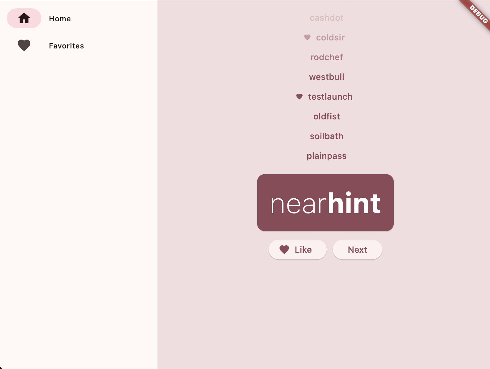
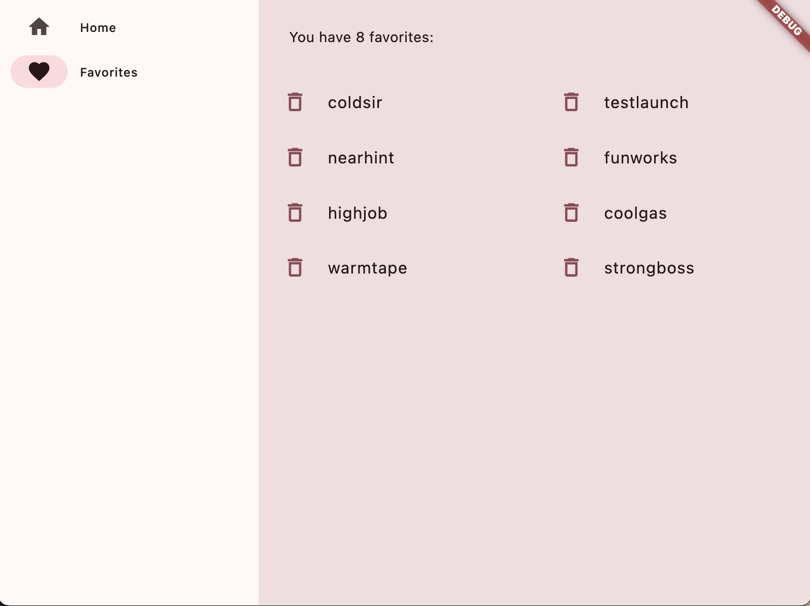

# 🧩 Namer App (Flutter)

This is a simple Flutter app that generates random name suggestions.  
Users can mark their favorite names and manage them by adding or removing from the favorites list.

This was the **first Flutter project** I built while following a tutorial by [Flutter’s official YouTube channel](https://youtu.be/8sAyPDLorek?si=S8UV1qngD-DXVIJ5). It served as my beginning to Flutter development, including basic widgets, state management, and navigation.

## ✨ Features

- 🔁 Generate random name pairs  
- ❤️ Mark names as favorites  
- 🗑️ Remove names from favorites  
- 📱 Responsive UI using Flutter widgets

## 💡 What I Learned

- The basics of how Flutter works
- Creating layouts in Flutter  
- Connecting user interactions (like button presses) to app behavior
- Keeping your Flutter code organized
- Making your app responsive
- Achieving a consistent look & feel of your app

## 🖥️ Screenshots

### Home Page

### Favorite Page

## 🛠️ Technologies Used

- Flutter  
- Dart

